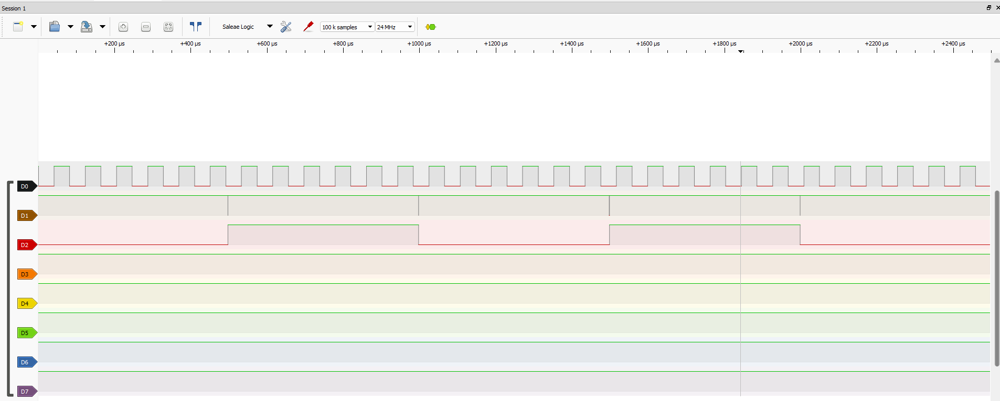
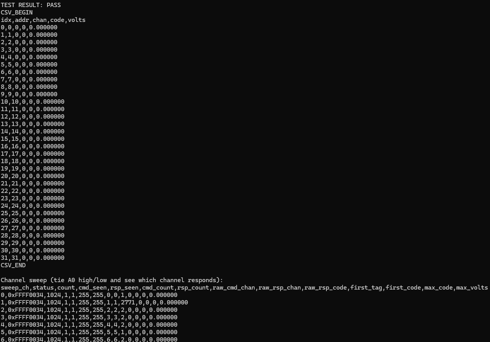

# ADC Sampling Controller for DE10-Lite

This project turns the Terasic DE10-Lite into a small FPGA-based data acquisition system using the MAX 10 internal ADC. It captures ADC samples into on-chip RAM, exposes the capture engine through Avalon-MM registers, and uses a Nios V application to configure the hardware and print captured samples over JTAG UART.

## What It Is

This repository is a reference design for:

- timer-driven ADC sampling on the DE10-Lite
- buffering captured samples in FPGA RAM
- controlling the capture engine from software
- reading sampled data back as CSV
- observing internal timing with simple debug pins

It combines custom HDL, Platform Designer integration, and a small Nios V test program into one runnable project.

## What It Can Be Used For

You can use this project as:

- a starting point for a simple oscilloscope-style capture tool
- a basic data logger for low-rate analog signals
- a reference design for MAX 10 internal ADC integration
- an example of custom Avalon-MM IP connected to Nios V
- a base for more advanced trigger, scan, streaming, and calibration features

## Tested Setup

The current project has been tested with:

- Terasic DE10-Lite
- MAX 10 `10M50DA`
- Quartus Prime Lite `25.1std`
- Platform Designer / Qsys
- Nios V/m
- JTAG UART for console output
- PulseView with a 24 MHz logic analyzer for digital debug signals

## Current Verified Status

The currently verified flow is:

- single-shot capture into on-chip RAM
- software readback over Avalon-MM
- CSV output over JTAG UART
- voltage scaling in software
- analog input testing on the DE10-Lite analog header
- digital debug observation on the Arduino digital header

The advanced trigger, scan, and plotting path exists in the design, but the README and default test flow focus on the simple, verified single-shot path first.

## Quick Start

1. Build or regenerate the hardware if needed.
2. Compile the Quartus project.
3. Program the FPGA with `output_files/adc_sampling_controller.sof`.
4. Build the Nios application in `software/app/build-gcc`.
5. Open JTAG UART.
6. Run `niosv-download -g app.elf`.
7. Connect `A0` to a known voltage and read the printed CSV output.

## Architecture

The main system is built inside [`adc_c.qsys`](adc_c.qsys). It contains:

- `ADC_SAMPLING_CONTROLLER_HW_IP`
- Intel Modular ADC core
- Nios V/m
- JTAG UART
- on-chip memory
- PLL
- HEX display PIOs

The board wrapper in [`DE10_LITE_ADC_SAMPLING_TOP.vhd`](DE10_LITE_ADC_SAMPLING_TOP.vhd) stays intentionally thin. It mainly connects the board clock, reset, HEX displays, and debug outputs to the Platform Designer system.

## How Capture Works

1. Software writes configuration registers in the sampling controller.
2. The trigger engine uses an internal timer to generate periodic ADC command requests.
3. The Modular ADC core returns `response_channel` and `response_data`.
4. The trigger engine packs each stored sample as:

```text
[15:12] = channel tag
[11:0]  = ADC code
```

5. Packed samples are written into the `sample_buffer` RAM.
6. Software reads the buffer back through the controller register interface.
7. Software converts raw ADC codes to volts.

## Default Software Test Flow

The current [`test.c`](software/app/test.c) default flow is a simple single-shot capture:

- default ADC input channel: `1`
- sample period: `5000`
- prescaler: `0`
- trigger logic disabled
- scan logic disabled
- first `32` samples printed as CSV over JTAG UART

For the current tested mapping:

- `A0` on the DE10-Lite analog header maps to ADC channel `1`

## Hardware Connections

### Analog Input

For the simplest first test:

- connect `A0` on the DE10-Lite analog header to the signal you want to measure
- connect the signal ground to board ground

Sanity-check examples:

- `A0 -> GND` should read near zero
- `A0 -> 3.3V` should read a large code

### Digital Debug Header

The board wrapper exports a few useful debug signals to the Arduino digital header:

- `ARDUINO_IO(0)` = slow heartbeat
- `ARDUINO_IO(1)` = sample marker
- `ARDUINO_IO(2)` = marker toggle
- `ARDUINO_IO(3)` = `KEY(1)` reset state

These are useful with a logic analyzer, but they are separate from the analog ADC inputs.

## Build And Program

### Regenerate Platform Designer HDL When Needed

Regenerate [`adc_c.qsys`](adc_c.qsys) if you changed:

- `adc_c.qsys`
- Platform Designer-owned generated contents
- embedded IP settings owned by Platform Designer

Example:

```powershell
& "<quartus_install>\quartus\sopc_builder\bin\qsys-generate.exe" `
  ".\adc_c.qsys" --synthesis=VHDL
```

### Compile Quartus

From the repository root:

```powershell
& "<quartus_install>\quartus\bin64\quartus_sh.exe" --flow compile adc_sampling_controller
```

This generates:

- `output_files/adc_sampling_controller.sof`

### Program The FPGA

Example:

```powershell
& "<quartus_install>\quartus\bin64\quartus_pgm.exe" -m jtag -c 1 `
  -o "p;output_files/adc_sampling_controller.sof@1"
```

## Run The Software Test

### Build The Nios App

```powershell
Set-Location ".\software\app\build-gcc"
cmake --build .
```

### Open JTAG UART

```powershell
& "<quartus_install>\quartus\bin64\juart-terminal.exe"
```

### Download And Run The ELF

Run this from a proper `niosv-shell`, or from a shell with the Nios tools on `PATH`:

```bat
cd /d software\app\build-gcc
niosv-download -g app.elf
```

## Output Format

The test app prints:

- configuration summary
- controller status
- sample count
- CSV data in the form:

```text
idx,addr,chan,code,volts
```

Where:

- `chan` is the stored channel tag
- `code` is the raw 12-bit ADC value
- `volts` is scaled in software using:

```text
V = code * Vref / 4095
```

## Register Interface Summary

The sampling controller exposes these key registers through Avalon-MM:

- `CONTROL`
- `PRESCALER_SEL`
- `ADC_CHANNEL_SEL`
- `SAMPLE_PERIOD`
- `STATUS`
- `SAMPLE_COUNT`
- `TRIGGER_INDEX`
- `READ_ADDR`
- `READ_DATA`
- `TRIGGER_CFG`
- `TRIGGER_LEVEL`
- `TRIGGER_CHANNEL`
- `PRE_TRIGGER_COUNT`
- `POST_TRIGGER_COUNT`
- `SCAN_CTRL`
- `SCAN_TABLE`

The software-side register definitions are in [`adc_sampling_controller_hw_ip.h`](software/hal_bsp/drivers/inc/adc_sampling_controller_hw_ip.h).

## Example Output

The first image shows example JTAG UART output from the software test. The second image shows the exported digital debug signals in PulseView.




## Important Notes

- The ADC analog header is different from the Arduino digital header. `A0` is not `ARDUINO_IO(0)`.
- The `sample_buffer` RAM is intentionally not power-up initialized, because RAM initialization caused MAX 10 assembler issues in this project.
- The top-level wrapper should stay thin; most logic belongs inside `adc_c.qsys` and the custom IP.
- If you change only custom IP HDL, Quartus recompilation is usually enough.
- If you change Platform Designer-owned configuration, regenerate `adc_c` before recompiling.

## Main Files

- [`adc_c.qsys`](adc_c.qsys)
- [`DE10_LITE_ADC_SAMPLING_TOP.vhd`](DE10_LITE_ADC_SAMPLING_TOP.vhd)
- [`ADC_SAMPLING_CONTROLLER_HW_IP.vhd`](ip/ADC_Sampling_Controller_HW_ip/HDL/ADC_SAMPLING_CONTROLLER_HW_IP.vhd)
- [`adc_trigger_engine.vhd`](ip/ADC_Sampling_Controller_HW_ip/HDL/adc_trigger_engine.vhd)
- [`test.c`](software/app/test.c)
