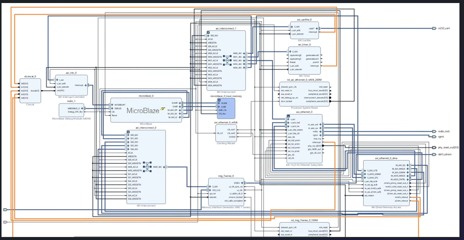
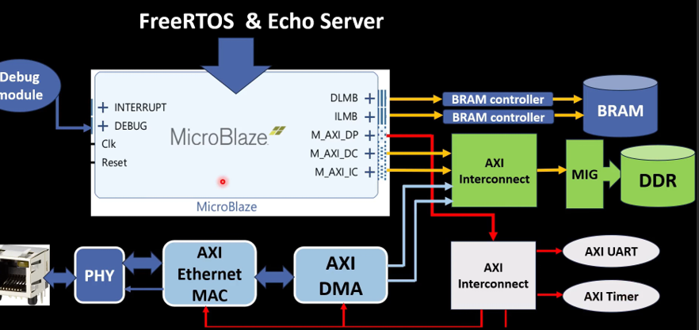

# Artix-7 AC701 Ethernet Reference Design

This repository contains a Vivado project that implements an Ethernet-enabled system for the Xilinx/AMD Artix-7 AC701 evaluation board. The top-level RTL is autogenerated from a Vivado Block Design (`design_1`) and integrates an Ethernet MAC (RGMII), MDIO PHY management, a soft-core processor for control, DDR3 memory (MIG), UART for console, timers/interrupts, and the necessary AXI interconnect.

## Project Details
- Device: `xc7a200tfbg676-2` 
- Board: `xilinx.com:ac701:part0:1.4` 
- Vivado: `2025.2` (`ethernet.xpr:2`)
- Top wrapper: `design_1_wrapper` (`ethernet.gen/sources_1/bd/design_1/hdl/design_1_wrapper`)

## Top-Level I/O Summary
Key interfaces are exposed by `design_1_wrapper`:

## Integrated IP (Block Design)
The block design `design_1.bd` references the following major IP cores :
- AXI Ethernet Subsystem with DMA
- AXI Interconnect and AXI Timer
- AXI UARTLite (console)
- AXI Interrupt Controller
- MIG 7 Series DDR3 SDRAM controller
- Soft-core processor (`microblaze_riscv_0_0`) for control
- Reset generators and utility cores

## Prerequisites
- Vivado Design Suite `2025.2` or later
- AC701 board with onboard RJ45 (RGMII PHY), DDR3 SODIMM, differential system clock connected
- USB/JTAG cable for programming; optional USB-UART for console

## Build and Program
1. Open the project: `File → Open Project` and select `ethernet.xpr`.
2. Regenerate outputs (if needed): `Flow → Generate Block Design Output Products` for `design_1`.
3. Run Synthesis: `Flow → Run Synthesis`.
4. Run Implementation: `Flow → Run Implementation`.
5. Generate Bitstream: `Flow → Generate Bitstream`.
6. Program Device: `Open Hardware Manager → Open Target → Auto Connect → Program Device` and select the generated `.bit`.

## Simulation
- Active sim set: `sim_1` (`ethernet.xpr:47`). Use `Flow → Run Simulation → Run Behavioral Simulation`.
- XSIM artifacts are under `ethernet.sim/`.

## Notes
- The MDIO signals include an inout port with an IOBUF instantiation in the wrapper.
- The DDR3 interface targets the AC701 SODIMM via MIG; ensure proper board power-up timing.
- UARTLite provides a simple console for debug/printf through RS-232 levels on AC701.

## License
IP cores and autogenerated sources include Xilinx/AMD licensing headers. Consult Vivado/AMD licensing terms for redistribution and usage.

