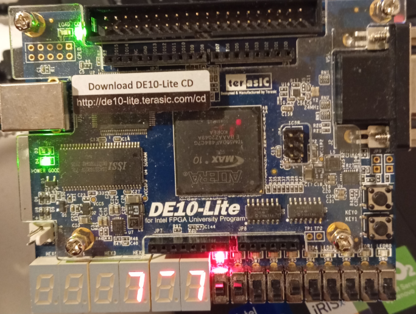

# Ping Pong Game – DE10-Lite FPGA

A complete 1-vs-1 ping pong game for the Terasic DE10-Lite FPGA board (MAX10).

## 🎮 Gameplay & User Guide

For detailed instructions on how to play, controls, and game modes, please see the **[User Guide](docs/USER_GUIDE.md)**.

**Key Features:**
*   **10 LEDs** as the ball court
*   **7-segment displays** (HEX0–HEX2) for score with animated dash
*   **VGA output** (640×480) for visual score display
*   **GPIO[0]** as speaker/buzzer output
*   **Switches SW[9..5]** as game controls (Menu, Difficulty, Reset)

---

## 🏗 System Architecture

The design is modular, with the `ping_pong_game` top-level entity orchestrating the following components:

```mermaid
graph TD
    subgraph Inputs
        CLK[50MHz Clock]
        SW[Switches]
    end

    subgraph Core Logic
        PLL[PLL (25MHz)]
        DEB[Button Debouncers]
        GSM[Game State Manager]
        PHY[Ball Physics]
    end

    subgraph Outputs
        VGA[VGA Controller]
        HEX[7-Segment Controller]
        LED[LED Controller]
        SND[Sound Generator]
    end

    CLK --> PLL
    SW --> DEB --> GSM
    PLL --> VGA
    
    GSM --> PHY
    PHY --> GSM
    
    GSM --> VGA
    GSM --> HEX
    GSM --> LED
    GSM --> SND
```

*   **Game State Manager**: Central FSM handling Menu, Serve, Play, Score, and Win states.
*   **Ball Physics**: Updates ball position based on speed/direction and detects paddle hits.
*   **VGA Controller**: Generates 640x480 timing and renders score bars based on game state.

---

## ✅ Verification & Testing

This project uses **Cocotb** (Python-based verification) for automated testing.
For full details on the verification environment, see **[Verification Docs](docs/README.md)**.

### Quick Run
To run all tests (requires Python + Questa/ModelSim or GHDL):
```bash
python run_verification.py
```
*   **--gui**: Runs in GUI mode for waveform debugging.
*   **--simulator ghdl**: Runs using open-source GHDL simulator.

### CI/CD
Automated testing is configured via **GitHub Actions** ([.github/workflows/ci.yml](.github/workflows/ci.yml)), running tests on every push using GHDL.

---

## 📂 Project Structure

| Directory / File | Description |
| :--- | :--- |
| **`docs/`** | Documentation (User Guide, Verification Guide) |
| **`tests/`** | Cocotb test sequences (`test_ping_pong_top.py`, `test_peripherals.py`) |
| **`sim_build/`** | Simulation artifacts (auto-generated) |
| `run_verification.py` | Main script to run tests |
| `ping_pong_game.vhdl` | **Top-level** structural module |
| `game_state_manager.vhdl` | Core game logic and state machine |
| `ball_physics.vhdl` | Ball movement and collision logic |
| `seven_seg_controller.vhdl` | HEX display controller with animation |
| `vga_controller.vhd` | VGA timing generator (640x480 @ 60Hz) |
| `vga_score_renderer.vhd` | Renders score bars on VGA |
| `sound_generator.vhdl` | Audio effects (PWM) |
| `pll.vhd` | Quartus PLL IP (50MHz -> 25MHz) |

---

## 🛠 Quartus Prime Setup

### 1. Generate PLL
1.  Open **IP Catalog** -> **ALTPLL**.
2.  Settings: **Input 50 MHz**, **Output c0 25 MHz**.
3.  Save as `pll.vhd`.

### 2. Create Project
1.  New Project -> Device: **10M50DAF484C7G** (DE10-Lite).
2.  Add all `.vhdl` and `.vhd` files.
3.  Set **`ping_pong_game`** as the Top-Level Entity.

### 3. Pin Assignments
Add these to your `.qsf` file or Pin Planner:

```tcl
# Clock
set_location_assignment PIN_P11 -to MAX10_CLK1_50

# Switches
set_location_assignment PIN_F15 -to SW[9]
set_location_assignment PIN_B14 -to SW[8]
set_location_assignment PIN_A11 -to SW[7]
# ... (Map remaining SW[6..0] to corresponding pins)

# LEDs
set_location_assignment PIN_B11 -to LEDR[9]
set_location_assignment PIN_A8  -to LEDR[0]
# ... (Map remaining LEDR)

# VGA
set_location_assignment PIN_N3 -to VGA_HS
set_location_assignment PIN_N1 -to VGA_VS
set_location_assignment PIN_AA1 -to VGA_R[0]
# ... (See User Manual for full VGA mapping)

# Audio
set_location_assignment PIN_V10 -to GPIO[0]
```
> **Note**: For full pin assignments, refer to the DE10-Lite User Manual or the `DE10_LITE_Golden_Top.v` reference.

### 4. Compile & Program
1.  **Processing** -> **Start Compilation**.
2.  **Tools** -> **Programmer** -> Load `.sof` -> **Start**.

---

## 📺 VGA Display
The VGA output visualizes the game state:
*   **Left Bar**: Player 1 Score (Color coded 0-4)
*   **Right Bar**: Player 2 Score (Color coded 0-4)
*   **Center**: Animated dash syncs with HEX display.

---

## 🎥 Demo & Validation

Here is the game running on the actual DE10-Lite hardware.

### Live Gameplay
[](https://youtube.com/shorts/9x95ZKHR_uE)

> **Click the image above to watch the gameplay video on YouTube.**

### Hardware Setup

