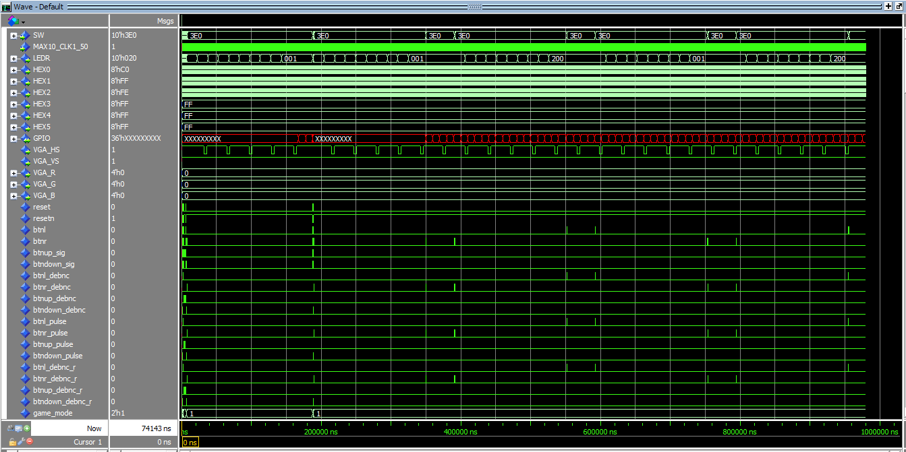
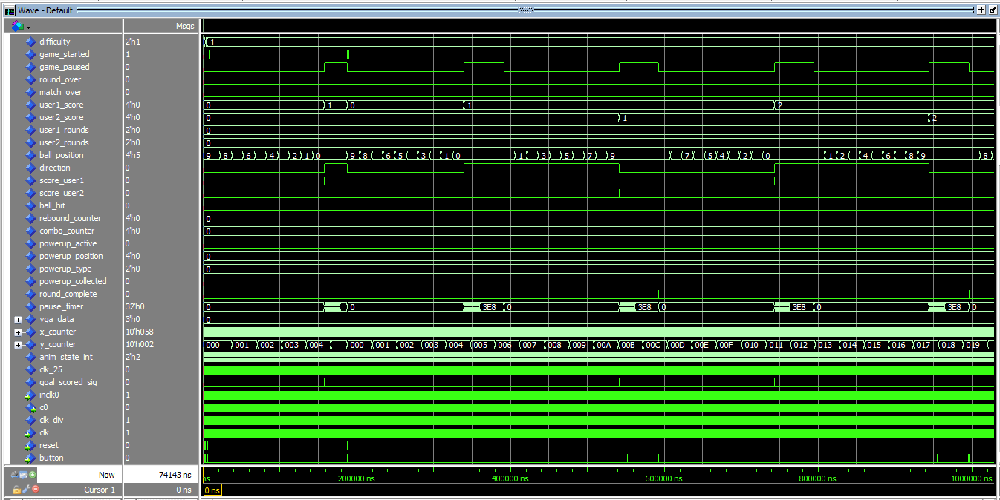
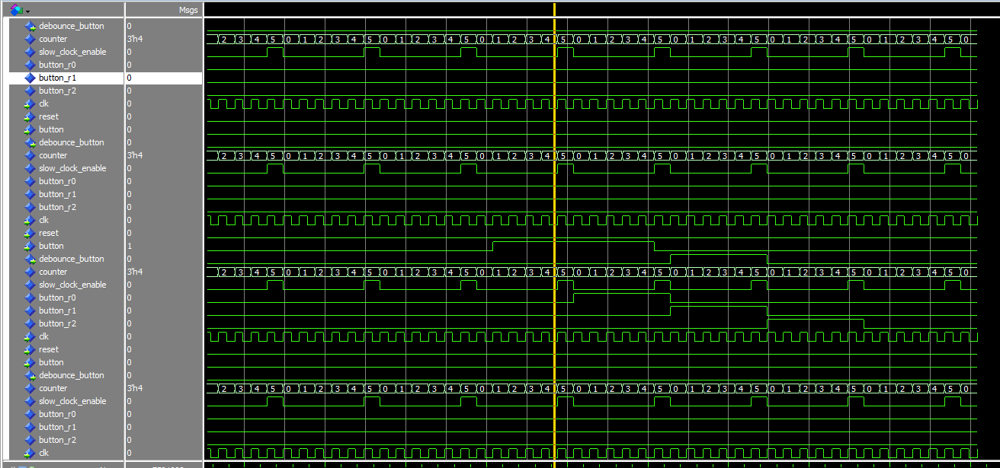
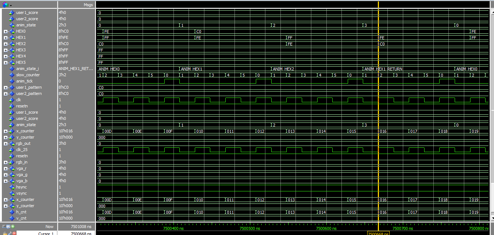

# Ping Pong Game Verification Guide

This document explains the verification setup for the FPGA Ping Pong Game project. The verification environment uses **Cocotb** (Coroutine Co-simulation Testbench) to drive a VHDL simulation running in **Questa/ModelSim**.

## 1. Overview

Instead of writing complex VHDL testbenches, we use **Python** to write high-level test scenarios. Cocotb bridges Python and the VHDL simulator, allowing us to:
- Drive inputs (buttons, switches, clock) from Python.
- Monitor outputs (LEDs, VGA signals, internal states) in Python.
- Write asynchronous, readable test sequences.

**Key Components:**
- **[run_verification.py](../run_verification.py)**: The main entry point. It compiles VHDL files, sets up the environment, and launches the simulator.
- **[tests/test_ping_pong_top.py](../tests/test_ping_pong_top.py)**: The actual test suite containing test cases.
- **Simulator**: Questa or ModelSim (Intel/Altera Edition).

---

## 2. Prerequisites

Before running tests, ensure you have:

1.  **Python 3.6+** installed (with `pip`).
2.  **Cocotb** installed:
    ```bash
    pip install cocotb
    ```
3.  **Questa / ModelSim** installed and available in your system `PATH` (or configured in `run_verification.py`).
4.  **License File**: Ensure your `LM_LICENSE_FILE` environment variable is set, or the script will try to auto-detect common locations.

---

## 3. Simulation Results

Here are examples of the verification process running in **Questa Intel FPGA Starter Edition**.

### 3.1 Console Output
Running `python run_verification.py` compiles the VHDL design and runs the Python testbench.


### 3.2 Waveform Viewer
The `--gui` mode launches the simulator interface, allowing inspection of signal transitions (clock, reset, game states).


### 3.3 Test Summary
At the end of the run, a summary table confirms the status of all test cases.


### 3.4 Simulator Interface
The full Questa/ModelSim GUI showing the project hierarchy, transcripts, and wave window.


---

## 4. How to Run Tests

### 4.1 Command Line (Batch Mode)
For automated regression testing (fast, no GUI):

```powershell
python run_verification.py
```
This will:
1. Compile all VHDL files in the project root.
2. Run the simulation in console mode.
3. Print `PASS` / `FAIL` for each test case.

### 3.2 GUI Mode (Waveform Debugging)
To inspect signals and debug failures visually:

```powershell
python run_verification.py --gui
```
This will:
1. Launch the Questa/ModelSim GUI.
2. Load the design and testbench.
3. Add all signals to the Wave window.
4. Run the simulation (it will remain open for inspection).

---

## 4. Test Suite Description

The tests are located in `tests/test_ping_pong_top.py` and cover the following scenarios:

| Test Case | Description |
| :--- | :--- |
| **`test_game_init`** | Verifies the system resets correctly into **Menu Mode** (Game Mode 0). |
| **`test_menu_navigation`** | Checks navigation between Menu, Tournament, and Practice modes using buttons. |
| **`test_difficulty_change`** | Verifies that pressing `Up` cycles through difficulty levels (1→2→3→0). |
| **`test_game_flow`** | Starts a game, waits for ball movement, and confirms a score event occurs (using a timeout). |
| **`test_match_win`** | Simulates a complete match (~12 mins sim time) until a player wins 3 rounds. |

---

## 5. Directory Structure

```
C:\FPGA-\ping_pong_game\
├── run_verification.py       # Build & Run script
├── tests\
│   └── test_ping_pong_top.py # Cocotb test cases
├── sim_build\                # Compilation artifacts (auto-generated)
├── docs\
│   └── README.md             # This file
└── *.vhdl                    # VHDL Source files
```

## 6. Configuration & Troubleshooting

### **Simulator Not Found**
If the script cannot find `vsim.exe`, it looks in standard Intel/Altera installation paths (e.g., `C:\intelFPGA_lite`). You can override this by setting the `VSIM_BIN` environment variable to your `win64` directory.

### **License Errors**
The script attempts to find license files in `C:\altera_lite` or similar. If you have a custom license setup, ensure `LM_LICENSE_FILE` is set in your Windows environment variables.

### **Python DLL Issues**
Cocotb requires loading the Python DLL. The script attempts to find `python3x.dll` automatically. If you see "The specified module could not be found", ensure your Python installation is standard and accessible.
